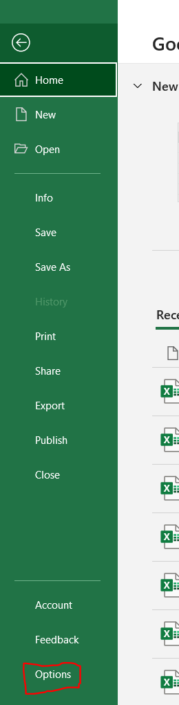
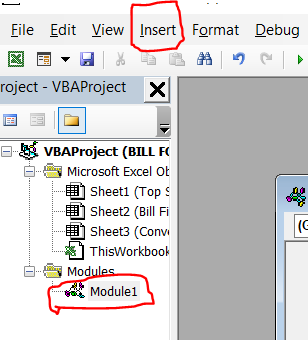
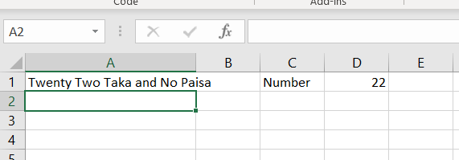

# Convert-Numbet-to-Word-Function-for-MS-Excel
This is a formula to convert number to word for MS Excel

# First go to File Then Options, File > Options

# Then select "Customize Ribbon" and selcet "Developer" option

# Then select "Visual Basic" and selcet "Developer" tab

# Then select "Insert" and selcet "Module" option then you will find "Module 1" and see a blank "General" file

# Copy the code and paste the code on the  blank "General" file then press "Alt+Q" Then Implement the function "=SpellNumber(A1)"  <A1 is the cell number of the selected cell>

# In the Save As box, in the Save as type list box, choose Excel Macro-Enabled Workbook (*.xlsm) then hit save

