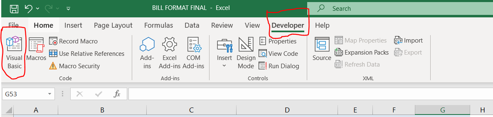
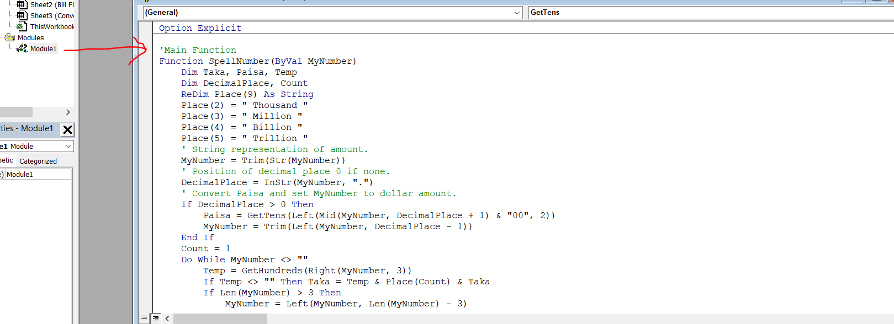

# Convert-Numbet-to-Word-Function-for-MS-Excel
This is a formula to convert number to word for MS Excel

# First go to File Then Options, File > Options

# Then select "Customize Ribbon" and selcet "Developer" option

